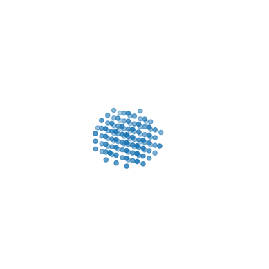
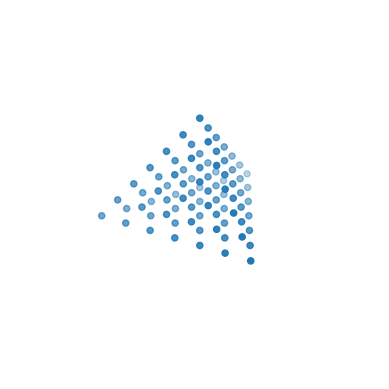

# Rotation

This project simulates the rotation of an object about the origin, by generating gifs with each frame a step towards a given target angular transformation.

## Requirements

The requirements to use this project are located in the `requirements.txt` file, shown below:

```
matplotlib==3.7.1
numpy==1.24.3
imageio==2.9.0
pynterface==0.2.0
```

To use the program, create a python virtual environment with these requirements and create a new terimnal.

## Usage

Assuming you have the prerequisites installed, you can run:

```
$ python3 main.py FILENAME
```

If running rotating gifs, `FILENAME` represents the name of the file you want the gif to be saved to.

Then, you will be prompted with a series of customization options in the terminal.

### Inputs

#### For Rotating GIFs

```
Enter the duration of the rotation in seconds (or -1 for auto): 
Enter the frames per second: 
```

These are self-explanatory; they adjust the speed and quality of the GIF. 

```
Enter the target pitch in degrees:
Enter the target roll in degrees:
Enter the target yaw in degrees:
```

These represent the different angles for rotation. They are in degrees and values greater than 360 are required for more than one full revolution.

```
Select the type of shape to be modeled: 
    1. Rectangular Prism
    2. Sphere
    3. Tetrahedron
Please enter a number between 1 and 3:
```

This is how you select the shape to use. 

The rectangular prism takes in `l, w, h` - representing its dimensions. It is assumed that, if the dimensions are nonnegative, that the point with the lowest [x, y, z] values is the origin.

The sphere takes in `r` - representing its radius. It is assumed that the center is the origin.

The tetrahedron takes in `s` - representing the length of one side. It is assumed that the tip of the tetrahedron is the origin. 

Note: These claimed point values are simply visualized like this, but within the program, are not actually treated as such.

You will then be asked the following:

```
Enter an approximate number of points: 
Enter the point to revolve around in the format "x, y, z", or -1 to revolve around the center: 
```

The number of points is an approximation and not accurate. Additionally, the center is not the true center of rotation as some shape transformations must be done to allow the shape to rotate around the origin but seem as if it is rotating around this point.

Finally, you will be prompted to select your type of output: 

```
Enter the type of output:
    1. gif
    2. other
Please enter a number between 1 and 2:
```

Alernatively, if you edit the main function, you can directly call the `rotating_gif` functiob and pass in your own inputs:

```python3
rotating_gif(frames: int, 
             fps: int, 
             shape: list[Point], 
             name: str, 
             pitch: float | int, 
             roll: float | int, 
             yaw: float | int)
```

Presently, as of 2023-22-05, other methods are not programmed yet.

### Example Outputs

Here are some example GIFs that were generated:


```python3
rotating_gif(
    frames=600,
    fps=60,
    shape=rectangular_prism(
        l=4, w=5, h=9,
        n=200,
        point=(4, 5, 2)
    ),
    name="rect.gif",
    pitch=702,
    roll=-349.2,
    yaw=204
)
```

<hr>



```python3
rotating_gif(
    frames=300,
    fps=60,
    shape=sphere(
        r=5,
        n=200,
        point=(1, 1, 1)
    ),
    name="sphere.gif",
    pitch=360,
    roll=360,
    yaw=-360
)
```

<hr>



```python3
rotating_gif(
    frames=360,
    fps=60,
    shape=tetrahedron(
        s=4,
        n=50,
        point=-1
    ),
    name="tetrahedron.gif",
    pitch=0,
    roll=360,
    yaw=0
)
```